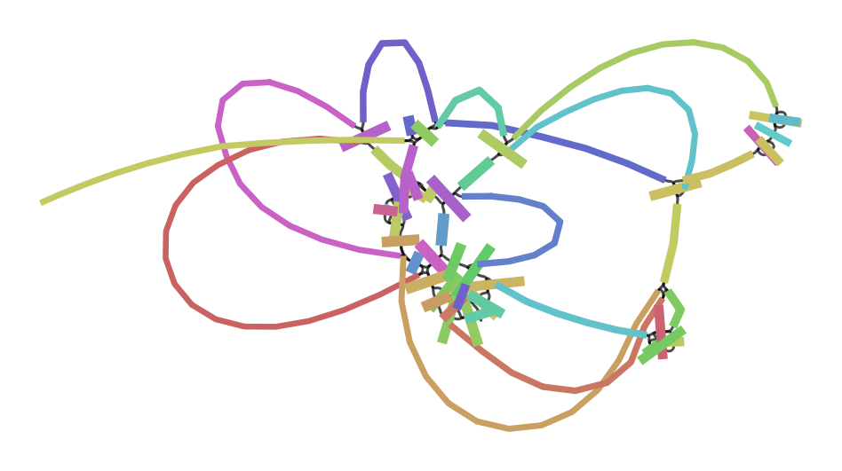
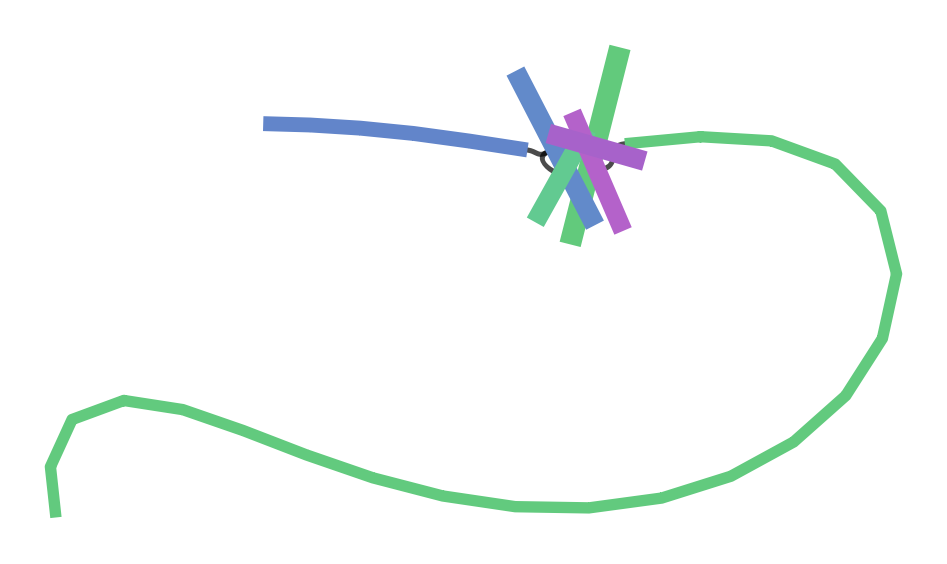
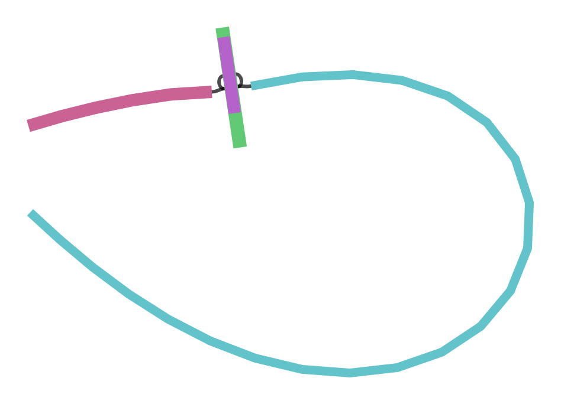
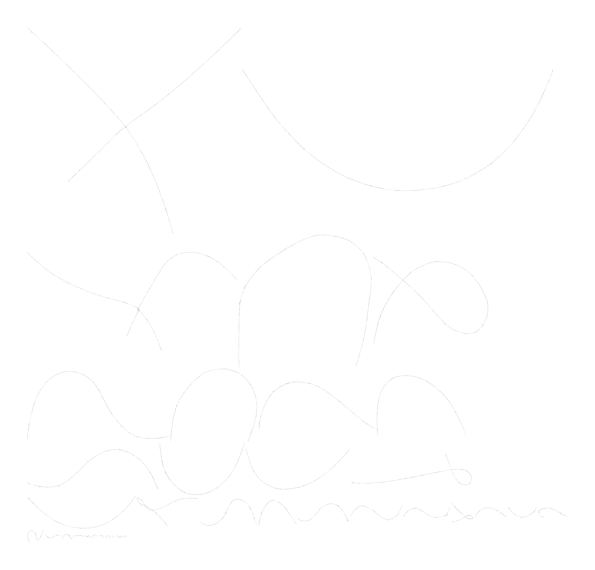
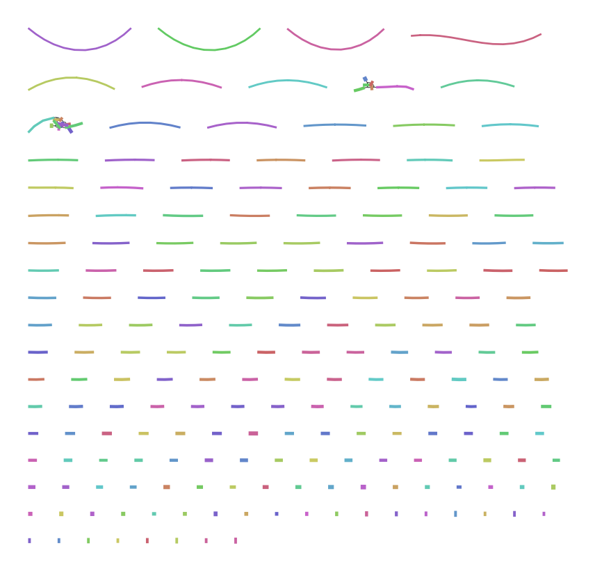

# Сборка генома: Графы де Брейна

## Описание проекта
В данной лабораторной реализовано построение, сжатие и очистка графа де Брейна для сборки участков генома E. coli из коротких прочтений. Проект написан на Python с использованием библиотеки `Biopython` для парсинга.

## 1. Анализ референсного генома
Мы построили графы де Брейна для файла `ecoli_1k.fna` при различных значениях парамера $k$.

### $k = 15$

*Вывод:* Граф получается очень «запутанным», с большим количеством петель. Это происходит потому, что размер $k$-мера маленький, и в геноме встречается много одинаковых повторов длиной 15 нуклеотидов, которые склеиваются в одни и те же узлы.

### $k = 31$

*Вывод:* Граф сильно упростился, количество циклов уменьшилось. Также граф стал более линейным.

### $k = 55$

*Вывод:* Граф выродился в абсолютно линейную структуру. Так как референс имеет идеальное покрытие и нет ошибок, большой $k$-мер полностью разрешает все повторы в данной последовательности.

---

## 2. Анализ прочтений
Далее собирался граф из файла `ecoli_reads.fastq` (где присутствуют ошибки секвенирования и неравномерное покрытие). Использовался параметр $k = 31$.

### Сырой граф (до очистки)

*Вывод:* Вокруг основного пути возникает огромное количество пузырей (bubbles) и "ворсинок" (тупиковых ветвей/tips). Каждая ошибка в середине прочтения создает новый альтернативный путь, а ошибка на конце — тупиковую ветвь.

### Граф после очистки (Эвристики)

*Вывод:* После удаления тупиков (короче 2k) и удаления ребер с низким покрытием (coverage < 3) с последующим пере-сжатием, граф очистился от шума и стал намного ближе к референсной структуре.

## Структура решения
- Поддержка чтения FASTA/FASTQ через `Bio.SeqIO`. 
- Класс `DeBruijnGraph` управляет узлами ($k$-меры) и ребрами ($k+1$-меры).
- Сжатие реализовано через поиск вершин со степенями входа/выхода равными 1.
- GFA экспорт сохраняет контиги как `S` (segments), а связи (узлы-переходники) как структуры `L` (links).
